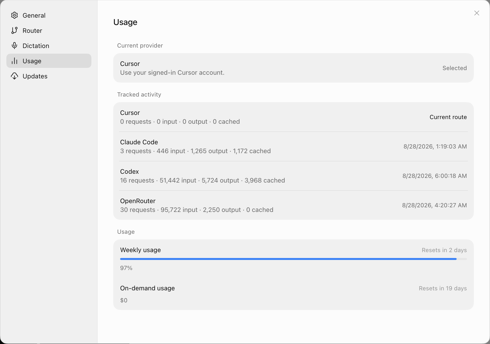

# OpenGrok



**A faster, more complete Grok Bot that runs without a Cursor subscription.**

Built from the checksum-pinned Grok Bot 0.18.0 macOS release, carried to feature
parity with official 0.29, and measurably smoother than official 0.29 on the
same conversation. Use it as a drop-in replacement for the official app.

The one thing it needs today is a Cursor account to sign in with, exactly as the
official client does. That is what [opengrok-grpc](#the-backend) removes.

## Why use this instead

**It is faster than the app it copies.** Measured live over CDP against official
0.29, same image-heavy conversation, real trackpad input:

| | before this work | **OpenGrok** | official 0.29 |
|---|---|---|---|
| frames over 50ms | 18 | **0** | 1 |
| frames over 100ms | 5 | **0** | 0 |
| worst frame | 134ms | **34ms** | 76ms |

Zero dropped frames, and a worst frame less than half of official's. Official
0.29 also renders box attachments broken on that same conversation; this does
not.

**It runs on providers the official app does not offer** — Codex, OpenRouter and
Claude Code alongside a normal Cursor account.

**It does things the official app cannot do at all** — per-message delete, in
particular, which official Grok Bot has no equivalent for at any layer.

## What was broken in stock 0.18, and is fixed here

These are defects in the shipped 0.18 build. Out of the box, without these
fixes, the app is either unusable or badly degraded.

- **The entire app rendered on the CPU.** 0.18's main process calls
  `app.disableHardwareAcceleration()` unconditionally — every graphics pipeline
  stage reports `disabled_software`. Now GPU-composited through ANGLE Metal:
  p95 frame time 17ms → 9ms. This one fix is most of the difference above.
- **You could not get past the sign-in wall without a Cursor account.** A
  "Choose Other Provider" path now starts the app on Codex, OpenRouter or
  Claude Code instead.
- **Real trackpad scrolling stalled** while programmatic scrolling measured
  perfectly smooth — a non-passive wheel listener on the transcript meant every
  tick waited on main-thread JS before the page could move.
- **The Usage tab was hidden** unless you were signed in to Cursor.
- **The transcript jumped while loading.** Row heights were estimated from
  per-kind constants, so cached media reflowed the moment it resolved. Official
  0.29 and 0.30 still do this. Here the estimate matches the render: fresh-launch
  scroll displacement 193px → **0**, and a 38,074px history insert under
  simulated 3G leaves all 64 on-screen rows pixel-identical.
- **Images were fetched at the wrong size**, then scaled. Variants are now
  requested at the size actually displayed — roughly 9× less over-fetch per tile.
- **The auto-updater would replace the app**, discarding the pinned build. It is
  disabled at the packaging boundary, along with upstream telemetry.

## What was added

**Inference routing** — Cursor, Claude Code, Codex and OpenRouter, with Grok Bot
plugin and MCP tools working across all of them, plus local usage tracking.

**Message management** — per-message delete, multi-select, bookmarks,
Collections (a page shared and bookmarked messages land in), self-contained HTML
export, and JSON import/export.

**Shareable deep links** — `opengrok://app/v1/message` links that jump-load
straight to a message.

**0.29 parity** — jump-to-newest pill, first-layout reveal gate, math rendering
in both bubble kinds, per-agent composer drafts.

**0.27 ports** — motion and spring easing, accent colours, notification sounds,
the activity taxonomy, and the Messaged-agent event row.

**Local Docker sandbox** — run the box host and execution daemon in an owned
local container, bound to loopback, instead of the remote sandbox.

**Diagnostics** — a ⌘⇧D media inspector and an opt-in layout lint with a
persistent findings report.

## Install

```sh
git clone https://github.com/hexuria/opengrok.git
cd opengrok
npm ci
npm run bootstrap
npm run package
ditto dist/Open Grok.app /Applications/Open Grok.app
```

`bootstrap` downloads the pinned 0.18.0 release, verifies its SHA-256, and
extracts what the build needs. `package` typechecks, tests, compiles, patches
the renderer, signs and verifies. Output is `dist/Open Grok.app`.

Requires macOS on Apple Silicon and Node.js 26.5.x.

## Routing

**Settings → Router** picks the backend for new turns.

| Provider | Sign-in |
|---|---|
| Cursor | your existing Grok Bot/Cursor session (default) |
| Codex | official `codex login` (ChatGPT) |
| OpenRouter | API key, stored in the desktop secrets bridge |
| Claude Code | official `claude /login` — **see below** |

Choosing Claude or Codex opens Terminal for the official CLI login when it is
not already signed in, and refuses the switch until that CLI reports a session.

> **Do not use the Claude Code route.** It works, but routing Claude through a
> third-party client this way is very likely against Anthropic's terms of
> service, and accounts have been suspended for less. We would not use it
> ourselves. Reach for Codex or OpenRouter.

## The backend

OpenGrok still signs in to Cursor and talks to Cursor's servers, the same as the
official client. **opengrok-grpc** is a separate project rebuilding that server
side — a Cursor-compatible gRPC API — so this client can run with no Cursor
dependency at all. It is private until it is complete and verified compatible.

Nothing here depends on it. The app works today either way.

## Status and honesty

The app is complete and in daily use. Treat it as a working replacement, not a
demo.

The caveats: macOS on Apple Silicon only, built from one pinned 0.18.0 release,
and while it matches official 0.29 it makes no promise about tracking future
Grok Bot versions. Names and module boundaries inferred from a compiled
application may differ from the original source. This is an unofficial project,
not an Anysphere release.

---

[Architecture](docs/ARCHITECTURE.md) ·
[Performance record](docs/performance-optimizations.md) ·
[0.30 gap analysis](docs/gap-analysis-0.30.md) ·
[Provenance](PROVENANCE.md) ·
[Contributing](CONTRIBUTING.md)
