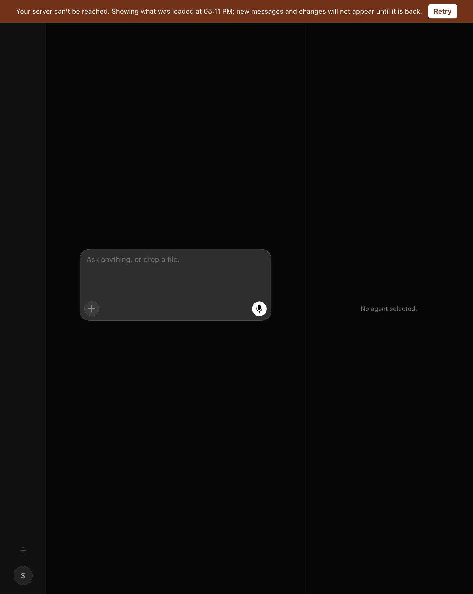
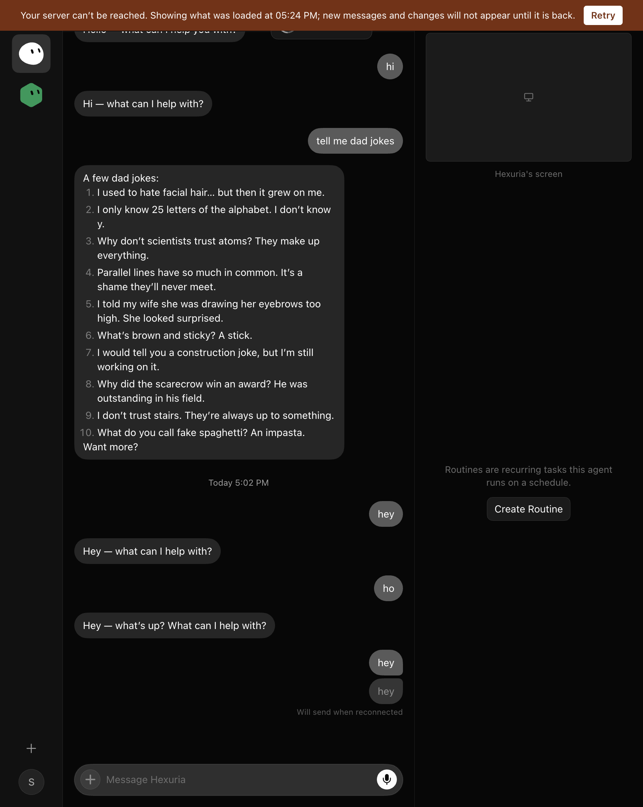
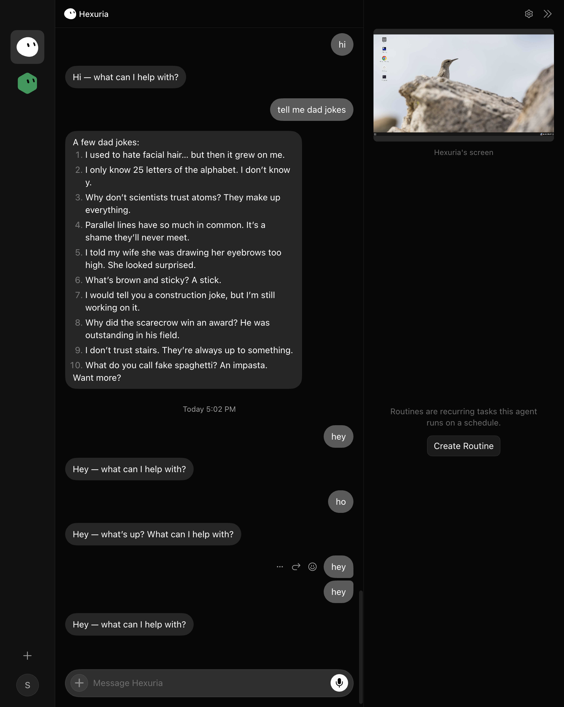

# Reads survive a dead server — evidence, 2 Sep 2026

The dev server's Postgres container (`opengrok-postgres`) was stopped with `docker stop`
and the desktop app was driven and probed over CDP (`.sand-agent-item[data-agent-id]`
count, banner presence, body text) once a second. Times are local (UTC+8).

## Before

On the OpenGrok route the page keeps nothing. With the database down every roster and
transcript read 500s ("pool timed out" after 10 s), and a refresh or a launch painted an
empty roster and "No agent selected" — read by the operator as "my bots have been deleted".
With the cache alone (first cut of this branch) the cached roster painted within a second
of a reload and was wiped about twelve seconds later, at the exact moment the event
stream reconnected:



Root cause of the wipe: the server opens every `/events` stream with a `complete-roster`
frame built from `roster_rows(...).unwrap_or_default()`, so with its database down it
sends "the roster is complete and empty, stamped current", and the page installs that as
its baseline. Reported to the server session; fixed server-side in
hexuria/opengrok-server#40 (no snapshot frame when the read fails).

## After

Cold launch with the database already down (17:25:19 stopped, 17:25:22 launched):

| time | roster rows | banner | note |
|---|---|---|---|
| 17:26:06 | 2 | no | window up; roster and transcript from the cache |
| 17:26:26 | 2 | yes | "Your server can't be reached. Showing what was loaded at 05:23 PM…" |
| 17:26:54 | 2 | yes | held for the rest of the outage |
| 17:27:11 | | | `docker start opengrok-postgres` |
| 17:27:14 | 2 | no | banner gone; reads live again after 54 s, on the cache's own retry |

Coordinator log during the run:

```
node-agent-coordinator: reads are failing (gateway-unreachable: roster unavailable); serving the last good answers
node-agent-coordinator: dropped an empty roster from the stream: the server could not read its roster
node-agent-coordinator: reads are live again after 54s
```





Reload mid-outage (17:23:23 stopped, 17:23:28 reloaded) gave the same picture: 2 rows from
17:23:29 through the outage, banner from 17:23:47, banner gone 3 s after the restart.

## What is not fixed here

- With the database down, a cold launch takes about 40 s to show its window
  (`sand.desktop.startup ready 40742ms`): the main process waits on health probes that
  each run to their deadline. Pre-existing, separate.
- While reads are stale the page is put into its transport-down mode, so sends are parked
  with "Will send when reconnected" and the box panel shows "Reconnecting". Both are true
  statements during an outage; they clear with the first live read.
