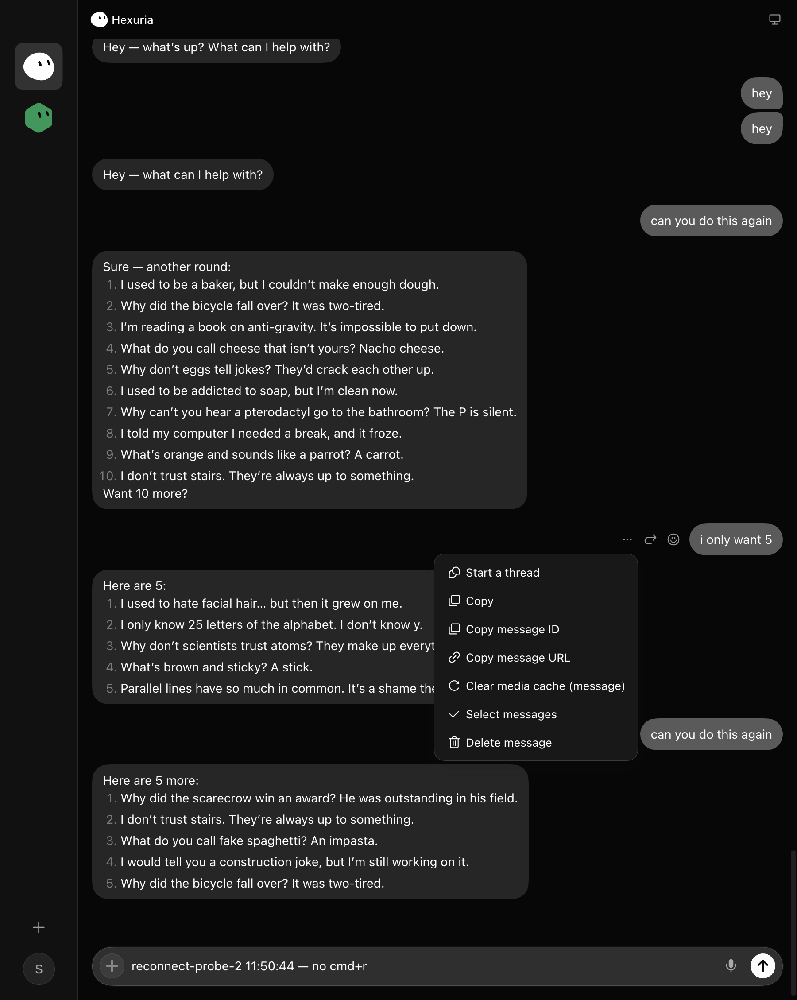
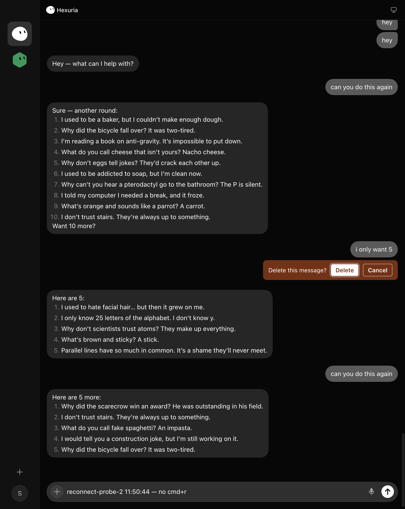
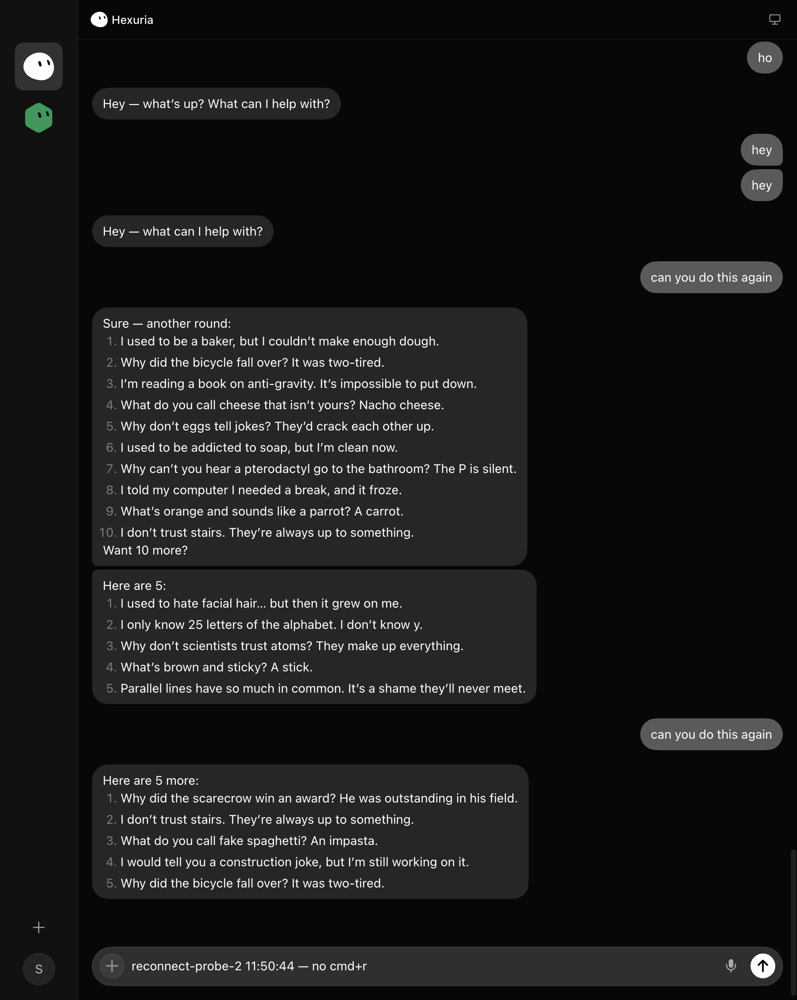

# Delete message — evidence, 2 Sep 2026

Driven over CDP against the dev OpenGrok server (`https://uriahs-MacBook-Pro.local:1447`),
coworker Hexuria, message "i only want 5" (`e_01a06178-67db-7711-9936-8be4a4324a60`).

| step | probe | result |
|---|---|---|
| route | `desktop.agent.getTranscriptDeletion()` | `{available: true, route: "opengrok"}`; `__sandDeleteAvailable === true` |
| menu | hover the bubble, open "More message actions" | Start a thread · Copy · Copy message ID · Copy message URL · Clear media cache (message) · Select messages · **Delete message** |
| ask | choose Delete message | `.sand-delete-confirm` inside the message's own row: "Delete this message? · Delete · Cancel" |
| do | click Delete | the row is gone within 2.5 s; the strip with it; server log: `POST /api/deleteTranscriptEntries` |
| durable | `Page.reload`, reopen the chat | the row and its text are absent |

Not proven live: the Claude/Codex/OpenRouter route (unit-tested routing to the local
store; switching this Mac's provider for a proof would change the operator's settings) and
the Cursor route (unit-tested: not available, no item). "Copy message URL" in the same menu
still looks rows up by `data-entry-id`, which live rows do not carry; pre-existing, not touched.
