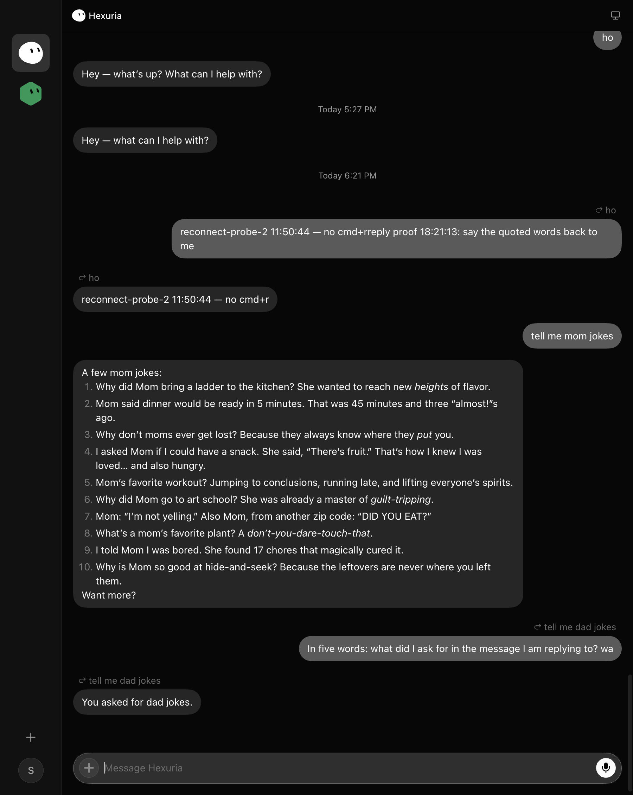
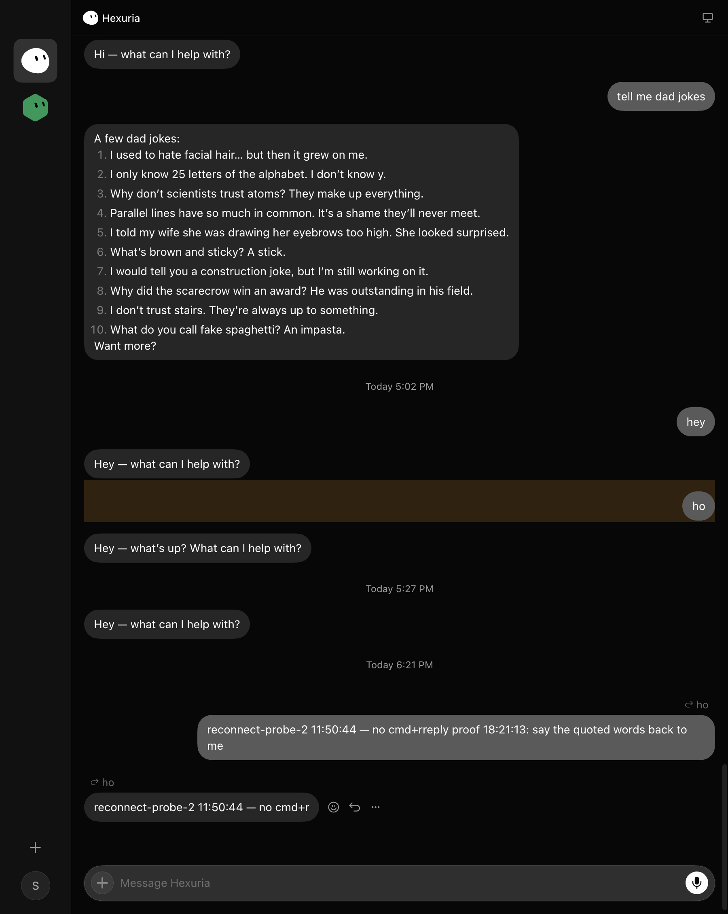

# Replies — evidence, 2 Sep 2026

The fix is server side (hexuria/opengrok-server#42, on the dev server from 10:11Z): the user
entry and its stream echo carry `replyTo`, the model is shown the quoted message ahead of the
prompt, and the answer's `send-message` carries the same `replyTo`. Nothing changed in the
client. This proves the page shows it, driven over CDP on the OpenGrok route, coworker Hexuria.

| step | what | result |
|---|---|---|
| reply | hover "tell me dad jokes", press its Reply button, type, Enter | the composer showed the quote chip; the sent row has `data-has-reply="true"` and the header "↩ tell me dad jokes" **after** the stream echo replaced the optimistic bubble (this is the row that used to lose it) |
| answer | wait for the bot | the answer row has `data-has-reply="true"`, the same header, and reads "You asked for dad jokes." to "In five words: what did I ask for in the message I am replying to?" |
| navigate | click the header on the sent row | the target row scrolled into view and gained highlight classes |

One of the two proof sends carried the operator's leftover composer draft ("reconnect-probe-2
11:50:44 — no cmd+r") in front of the proof text; the second send cleared the composer first.
