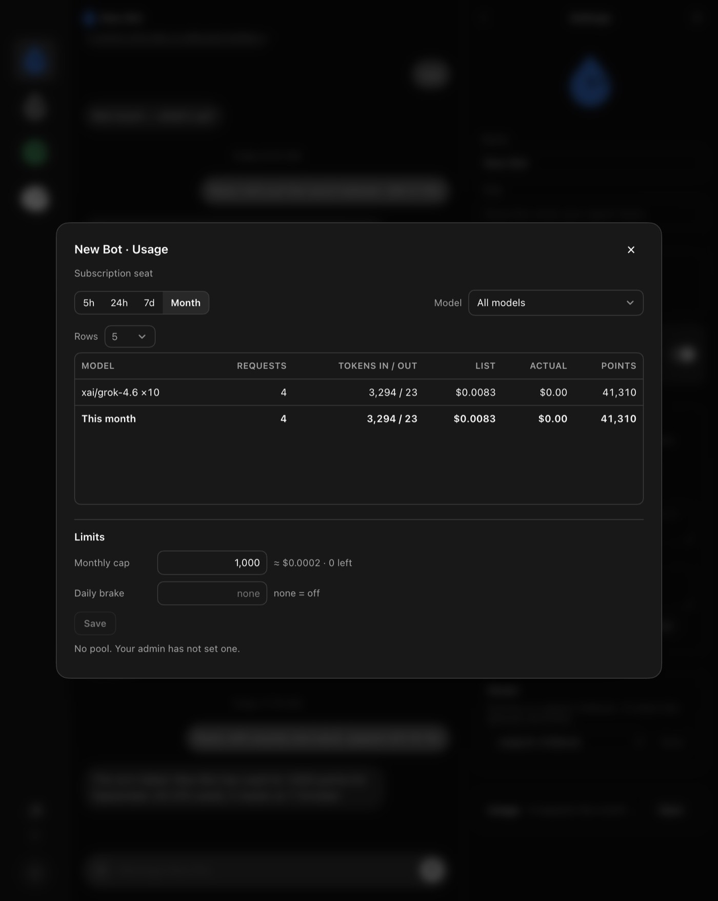
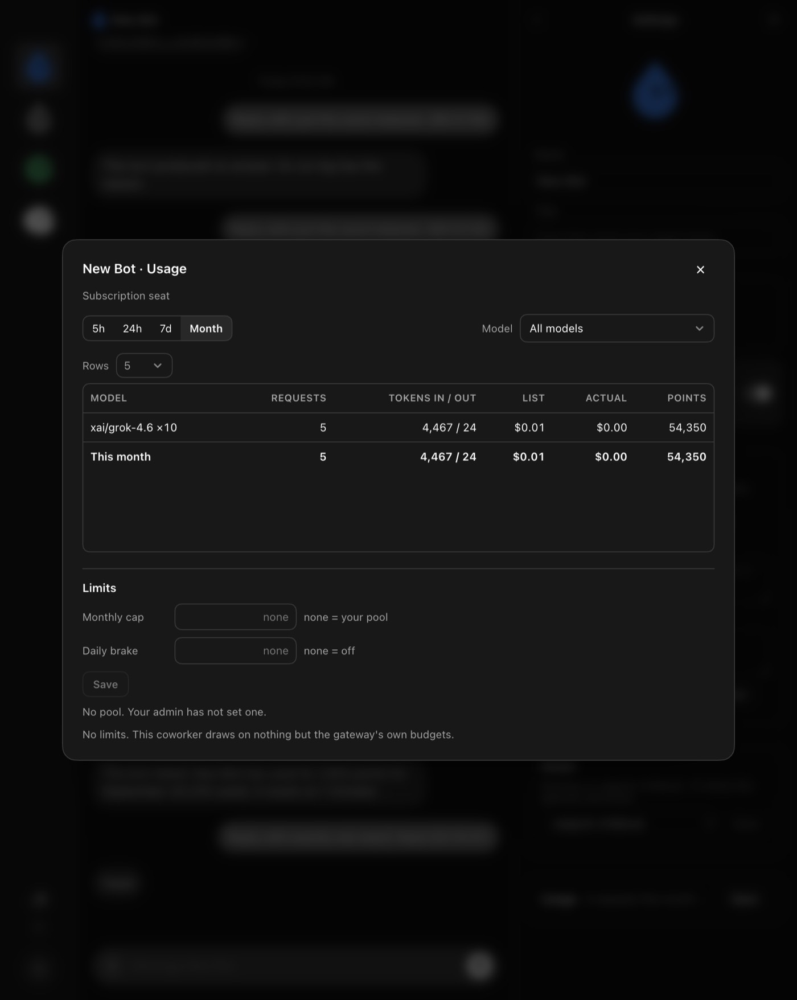
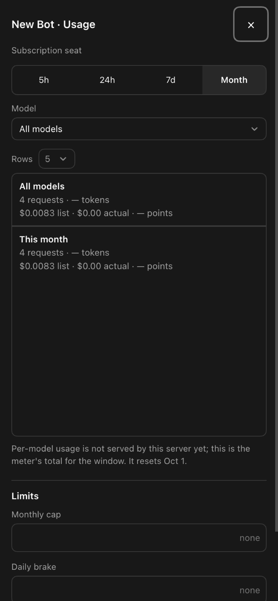

# Usage and points, proven on the desktop

Evidence for PRs #54 (Usage block), #55 (the modal), #56 (every width) and #57 (the room left), taken over CDP against opengrok-server main 0c5e8a7 (#49, points limits) and open-ai-gateway main deb25bd (#53, per-model usage) on 3 Sep 2026, reference price $0.20 per million tokens, coworker New Bot on a subscription seat.

## The loop

| step | what the desktop showed |
|---|---|
| Model picker | `xai/grok-4.6 ×10`, `openai/gpt-5-mini ×1.25` (points multipliers from the gateway) |
| Pane line | `Usage · 4 requests this month · 41,310 points · Open` |
| Modal, Month | `xai/grok-4.6 ×10 · 4 · 3,294 / 23 · $0.0083 · $0.00 · 41,310`; totals footer the same |
| Limits | `No pool. Your admin has not set one.` |
| Cap set to 1,000 from the modal | `≈ $0.0002 · 0 left · Saved` |
| Next turn | bubble: **The turn failed: New Bot has used its 1,000 points for September (41,310 used); it resets on 1 October** |
| Cap cleared | `none = your pool · Saved` |
| Next turn | answered `freed`; the row moved to `5 · 4,467 / 24 · $0.01 · $0.00 · 54,350` |

## Every width

Measured at 1280 × 800, 820 × 700 and 390 × 844 with device emulation (#56): label gap 8 px, chevron padding 30 px, the sheet's height constant when the filter changes (589/589 px), no sideways scroll, and at phone width a full-screen sheet with cards, a five-row frame capped at half the screen and a 44 px Close.

## How it was taken

`points-proof.mjs` and `modal-widths-proof.mjs` drive the installed package over the Chrome DevTools Protocol on port 9223: select the coworker, open Settings, read the pane line, open the modal, type the cap and click Save, send a turn through the composer, read the last bubble, screenshot. No fixture: the numbers are the gateway ledger's.
